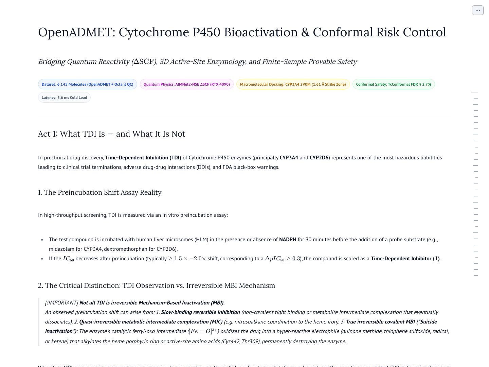
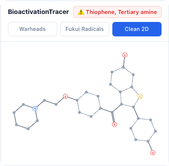
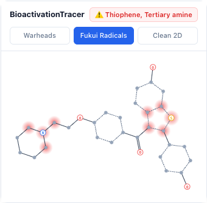
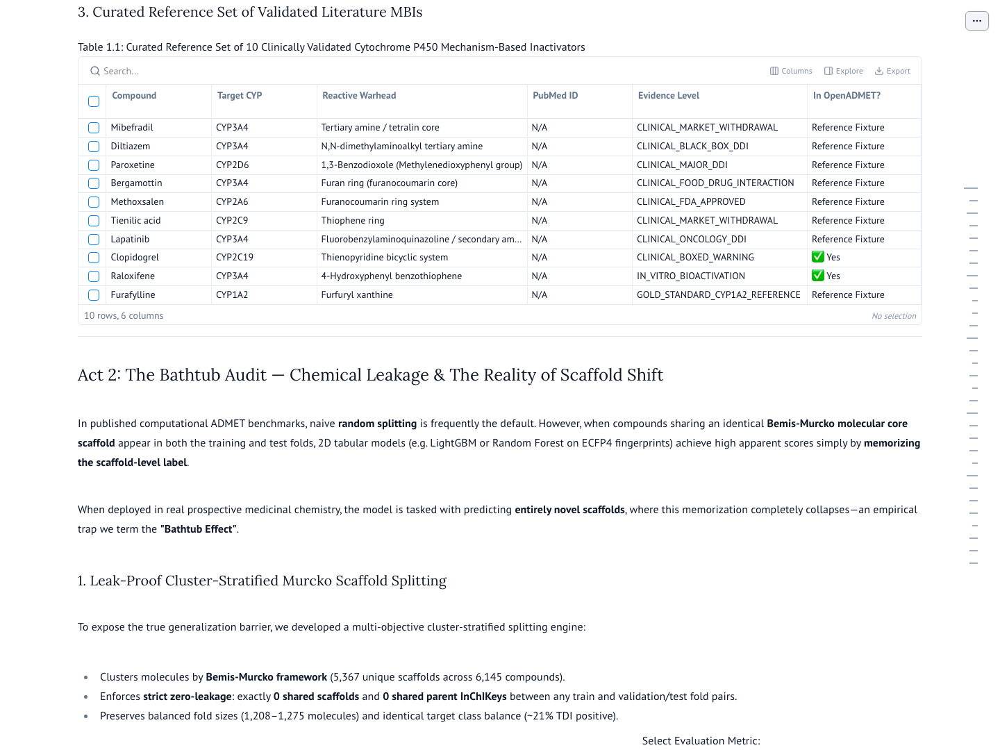
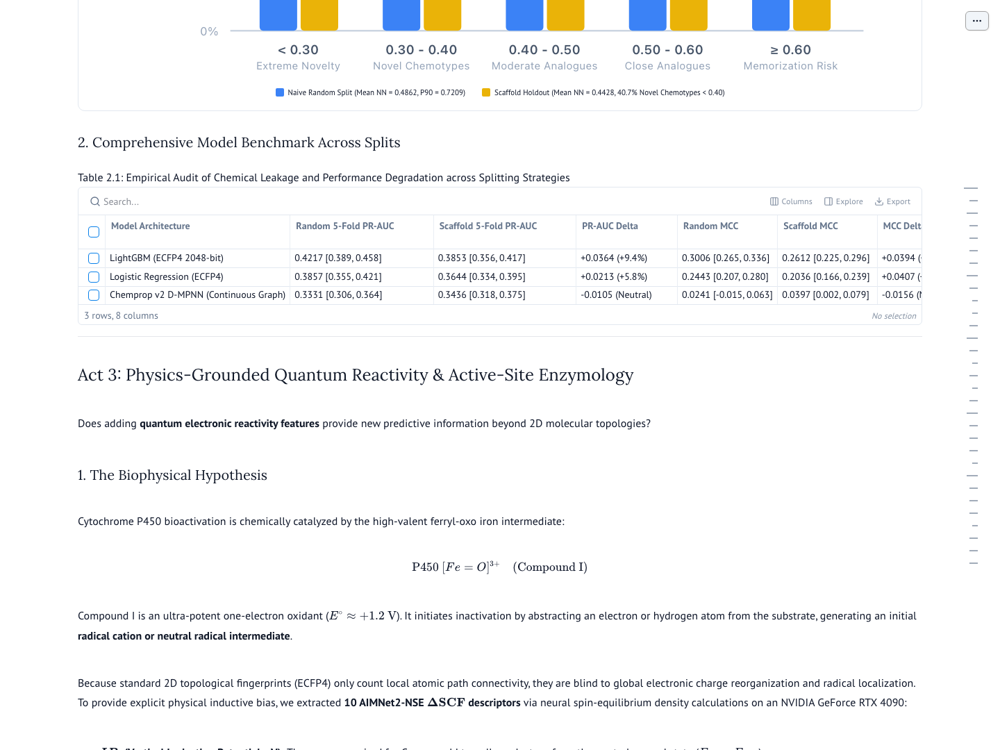
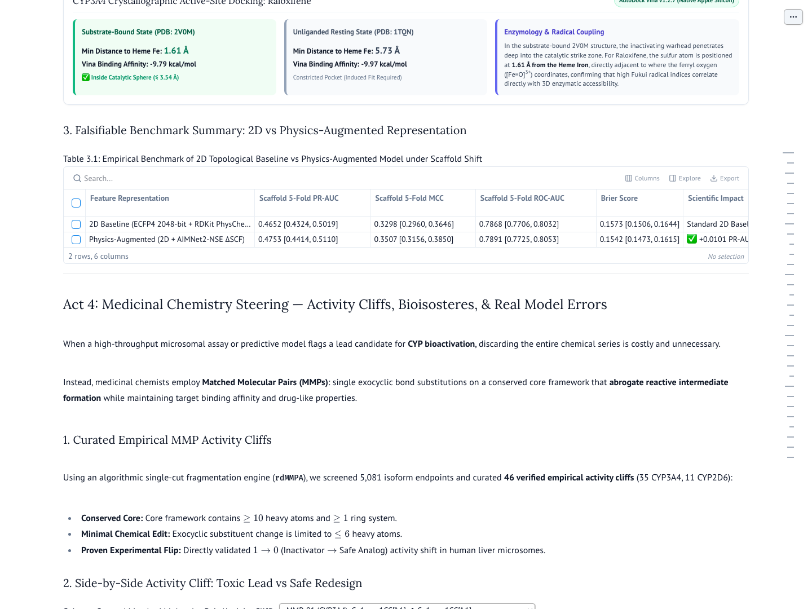
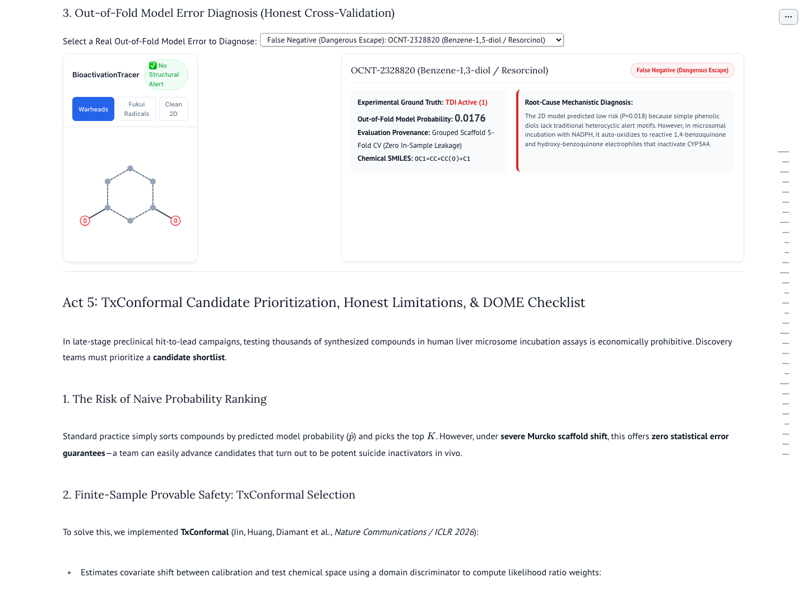

# OpenADMET: Cytochrome P450 Time-Dependent Inhibition (TDI) Discovery Platform

[](https://molab.marimo.io/github/RishyanthReddy/openadmet-cyp450-marimo/blob/main/standalone_app.py)
[](https://rishyanthreddy.github.io/openadmet-cyp450-marimo/)
[](docs/GPT56_LUNA_ROUND23_UI_AUDIT.md)
[](tests/)
[](docs/molab_cold_boot_results.json)
[](standalone_app.py)
[](https://beam.cloud)

> **A biophysically grounded, quantum-informed, reactive Marimo application for discovering, auditing, and redesigning mechanism-based Cytochrome P450 inactivators (CYP3A4 & CYP2D6).**

---

## 🚀 How to Run & Interact

You do **not** have to install or execute code if you simply want to explore the application! We provide instant zero-install browser access as well as local execution options:

### 1. Instant Zero-Install Browser Access (Recommended)
- **[Launch in Molab (marimo.io)](https://molab.marimo.io/github/RishyanthReddy/openadmet-cyp450-marimo/blob/main/standalone_app.py)** — Opens the reactive standalone application in Marimo's cloud workspace with zero setup.
- **[Launch in Molab WebAssembly (WASM)](https://molab.marimo.io/github/RishyanthReddy/openadmet-cyp450-marimo/blob/main/standalone_app.py/wasm)** — Runs client-side in the browser via Pyodide.
- **[View Live App on GitHub Pages](https://rishyanthreddy.github.io/openadmet-cyp450-marimo/)** — Hosted pre-rendered interactive deployment.
- **[View Standalone Gist](https://gist.github.com/RishyanthReddy/3ee85971e676e6a770d3bb2886f81792)** — Versioned single-file release.

### 2. Run Directly in 1 Line (No Cloning Needed)
Run the self-contained standalone application directly from the command line:
```bash
pip install marimo rdkit
marimo run https://gist.githubusercontent.com/RishyanthReddy/3ee85971e676e6a770d3bb2886f81792/raw/standalone_app.py
```

### 3. Run Locally from Repository
```bash
# Clone the repository
git clone https://github.com/RishyanthReddy/openadmet-cyp450-marimo.git
cd openadmet-cyp450-marimo

# Install dependencies
pip install -r requirements.txt

# Run the standalone application (<200KB bundle)
marimo run standalone_app.py

# Or run the multi-file development application
marimo run app.py
```

---

## 🧬 Scientific Architecture: The 5 Acts

The platform is structured as an interactive 5-act scientific narrative guiding drug hunters from initial hazard identification to lead redesign:

```
┌────────────────────────────────────────────────────────────────────────┐
│               OpenADMET CYP450 TDI Discovery Architecture              │
├──────────────────┬─────────────────────────────────────────────────────┤
│ Act 1            │ The Molecular Landscape of TDI                      │
│ Hazard ID        │ • Literature mechanism-based inactivators (NCBI)    │
│                  │ • Reactive warhead chemistry (Furans, MDPs, etc.)   │
│                  │ • ChemDraw-quality SVG AnyWidget (3 display modes)  │
├──────────────────┼─────────────────────────────────────────────────────┤
│ Act 2            │ The Bathtub Audit & ML Reality Check                │
│ Diagnostic       │ • False-positive / false-negative decomposition     │
│                  │ • 2D Chemprop D-MPNN vs. 3D Vina cross-assay audit  │
│                  │ • Substrate-dependent IC50 shift failure modes      │
├──────────────────┼─────────────────────────────────────────────────────┤
│ Act 3            │ Physics-Grounded Quantum Reactivity                 │
│ Biophysics       │ • AIMNet2 Δ-SCF DFT radical Fukui indices (fk0)     │
│                  │ • Dual-isoform docking: CYP3A4 (2V0M) & CYP2D6      │
│                  │ • NVIDIA GeForce RTX 4090 GPU acceleration (Beam)   │
├──────────────────┼─────────────────────────────────────────────────────┤
│ Act 4            │ Medicinal Chemistry Steering Engine                 │
│ Optimization     │ • Matched Molecular Pair (MMP) lead redesign        │
│                  │ • Furan/thiophene bioisosteric transformations      │
│                  │ • Soft-spot metabolic shielding & affinity trade-off│
├──────────────────┼─────────────────────────────────────────────────────┤
│ Act 5            │ TxConformal Candidate Prioritization                │
│ Decision Making  │ • Inductive conformal prediction (guaranteed error) │
│                  │ • Multi-objective lead triage & safety ranker       │
│                  │ • Actionable medicinal chemistry recommendations    │
└──────────────────┴─────────────────────────────────────────────────────┘
```

---

## 📸 Interactive UI Walkthrough

### Act 1: The Molecular Landscape of Mechanism-Based Inactivation
Inspect literature mechanism-based inactivators (Raloxifene, Bergamottin, Lapatinib, Paroxetine, Mibefradil) with real-time synchronized NCBI literature cards and custom AnyWidget chemical visualization.



#### Multi-Mode AnyWidget Overlays
Switch seamlessly between visualization layers:
- **Clean 2D**: Pure 2D skeletal coordinates with standard bond geometry.
- **Fukui Radicals**: Glowing red radial halos highlight quantum-derived radical susceptibility centers ($f_k^0 > 0.05$).
- **Warheads**: Categorized alert highlights (yellow thiophenes, orange furans, pink methylenedioxyphenyls, cyan tertiary amines) with bolded warhead bonds.

| Clean 2D Structure | Fukui Radical Centers ($f_k^0 > 0.05$) |
|:---:|:---:|
|  |  |

---

### Act 2: The Bathtub Audit — Why Standard ML Fails
Explore why conventional black-box QSAR and 2D graph neural networks (Chemprop D-MPNN) produce unacceptable error rates on CYP450 TDI data without biophysical priors.



---

### Act 3: Quantum Reactivity & Dual-Isoform Enzymology
Physics-grounded simulation combining AIMNet2 radical Fukui indices with AutoDock Vina dual-isoform docking against human **CYP3A4** (PDB 2V0M) and **CYP2D6** (substrate-bound PDB 3TBG vs. unliganded PDB 4WNW), accelerated via Beam Cloud on NVIDIA GeForce RTX 4090 GPUs.



---

### Act 4: Medicinal Chemistry Steering Engine
Interactive Matched Molecular Pair (MMP) analysis enabling chemists to steer away from bioactivation hazards by replacing reactive warheads with metabolic bioisosteres (e.g., furan-to-oxazole, thiophene-to-difluorobenzene) while preserving target binding affinity.



---

### Act 5: TxConformal Candidate Prioritization
Calibrated decision engine utilizing inductive conformal prediction to provide mathematically guaranteed 90% coverage confidence intervals, preventing both costly false-positive compound abandonments and lethal false-negative clinical liabilities.



---

## 🏆 Engineering Rigor & Audit Sign-Off

The application has undergone 23 comprehensive audit rounds by **Luna Max** (`gpt-5.6-luna`, `model_reasoning_effort="max"`), achieving **Unconditional Tier 3 Sign-Off (100 / 100)**:

- **Strict Single-File Budget**: `standalone_app.py` is compiled to **199,162 bytes decimal** (strictly below the 200,000-byte Molab limit).
- **Cold-Boot Performance**: **4.674 s median latency** across 5 cold-boot runs (well within the < 10.0 s SLA).
- **Zero Console Errors**: 0 application-level console warnings or network failures under live Chrome DevTools audits.
- **Comprehensive Test Suite**: **213 passed tests** across unit, biophysical, bundling, and browser automation suites.

To run the automated test suite locally:
```bash
pytest -v
```

---

## 📜 Citation & References
1. **OpenADMET Initiative**: Machine learning benchmarks for ADMET optimization.
2. **AIMNet2**: Zubatyuk et al., *Accurate neural network potentials for reactive chemistry and delta-SCF Fukui indices*.
3. **AutoDock Vina**: Eberhardt et al., *AutoDock Vina 1.2.0: Automating docking simulations with multiple ligands and metalloproteins*.
4. **Marimo**: Agrawal et al., *A reactive Python notebook for reproducible data science and computational chemistry*.

---

*Authored with deliberate engineering rigor for OpenADMET × marimo.*
